# 라이선스 검증 도구 코드아이(CodeEye) 사용법

VTT 연구 성과로 산출된 오픈소스가 라이선스를 잘 지키고 있는지 검증하기 위하여 라이선스 검증 도구인 [코드아이(CodeEye)](https://www.olis.or.kr/codeEye/introduction.do)를 씁니다.

# 1. 코드아이 클라이언트 다운로드
[OLIS](https://www.olis.or.kr/)에 접속한다.

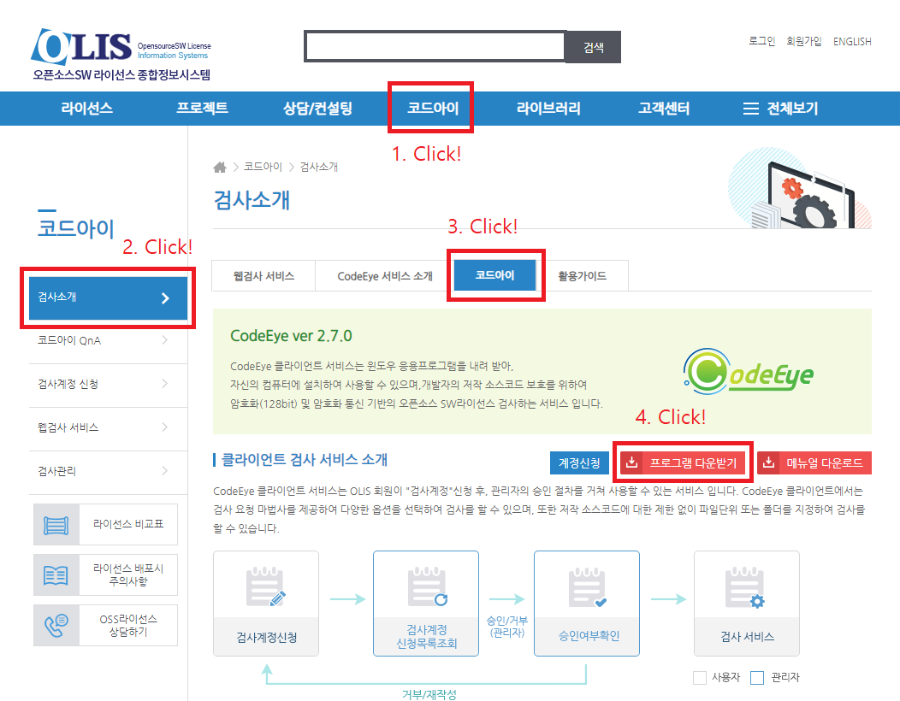

1. 페이지 위쪽 **코드아이** 탭 클릭
1. 페이지 왼쪽 **검사소개** 탭 클릭
1. 검사소개 페이지에서 **코드아이** 탭 클릭
1. '클라이언트 검사 서비스 소개' 옆 '**프로그램 다운받기**' 클릭

# 2. 코드아이 클라이언트 설치
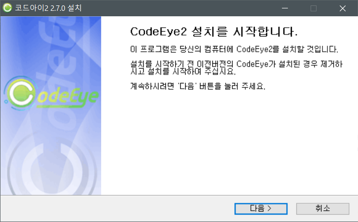
* 기본 설정으로 설치를 진행한다.

# 3. 코드아이 클라이언트 실행 및 로그인
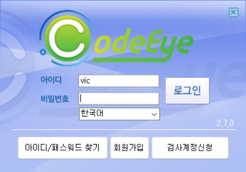
* VIC(Video Intelligence Center) 공용 계정을 이용한다.
* 공용 계정 아이디: vic
* 공용 계정 비밀번호: 메일로 통지

# 4. 라이선스 검증을 진행할 GitHub repository 다운로드
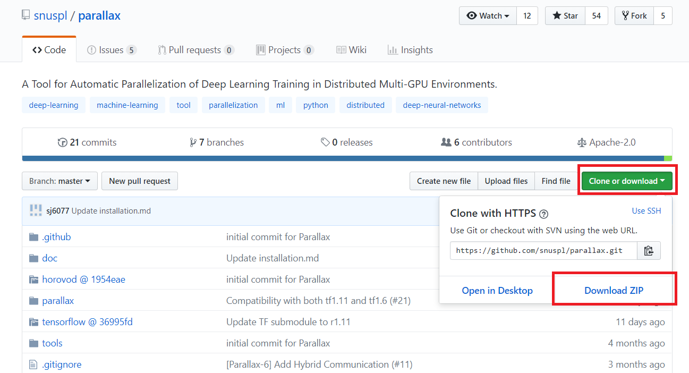

1. VTT 연구 성과로 제출할 오픈소스를 **저작자(연구원, 연구실, 기업) GitHub** 에 repository로 공개한다.
2. 공개한 repository GitHub에 접속하면 화면 오른쪽에 있는 **Clone or download** 를 클릭한다.
1. **Download ZIP** 을 클릭해 repository의 zip을 다운로드한다.
1. 다운로드한 zip의 압축을 푼다.

# 5. 라이선스 검사 요청
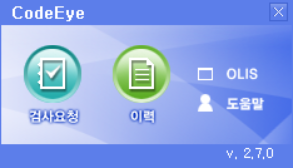
* 코드아이 클라이언트에 로그인을 하면 화면 오른쪽 아래에 위 그림과 같은 창이 뜬다. **검사요청** 을 클릭한다.

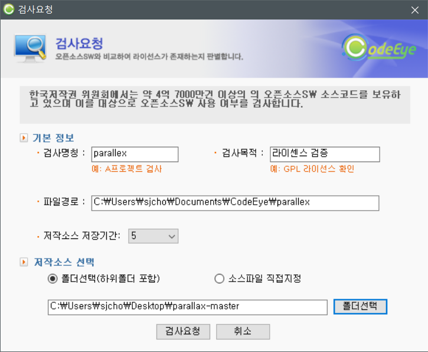
1. 위와 같은 창이 뜬다.
1. **검사명칭** 은 repository 이름으로 채운다.
1. **검사목적** 은 간단히 '라이센스 검증'이라고 채운다.
1. **저작소스 저장기간** 은 5일로 설정한다.
1. **저작소스 선택** 에서 **폴더선택** 을 선택한다.
1. **폴더선택** 을 클릭해서 압축을 푼 repository 폴더를 선택한다.
1. **검사요청** 을 선택한다

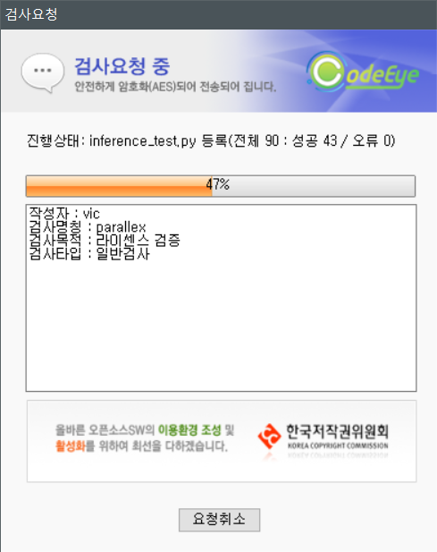
* 검사요청을 하는 중이다.

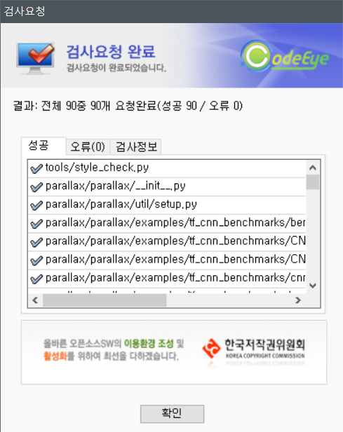
1. 검사요청이 완료되면 위와 같이 나타난다.
1. **확인** 클릭하여 검사요청을 마무리한다.

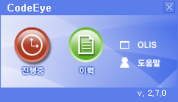
1. 그러면 위 그림과 같이 화면 오른쪽 아래에서 검사가 진행 중임을 알 수 있다.
2. 여기서 **진행중** 을 클릭하면 아래 그림과 같이 검사 과정을 볼 수 있다.

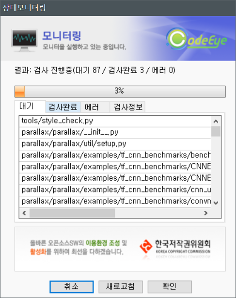
* **취소** 를 누르면 검사가 중지된다.
* **새로고침** 을 누르면 현재 검사 과정을 볼 수 있다.
* **확인** 을 누르면 상태 모니터링 창을 닫을 수 있다.

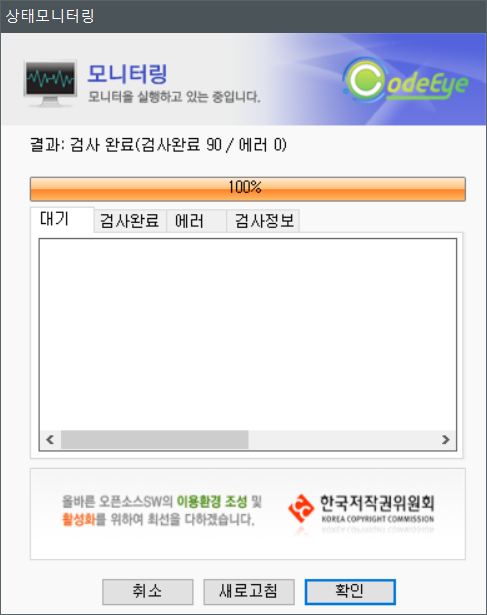
1. 라이선스 검사가 완료되면 위와 같은 창이 나온다.
1. 확인을 눌러 창을 닫는다.

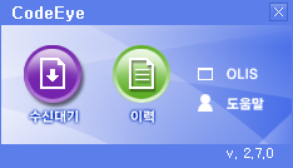
* 오른쪽 아래 화면을 보면 창이 이렇게 바뀐다. **수신대기** 를 클릭한다.

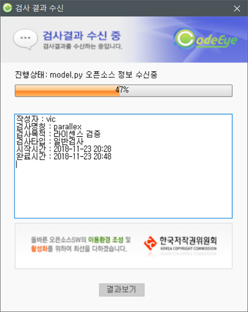
* 그러면 라이선스 검사 결과를 수신한다.

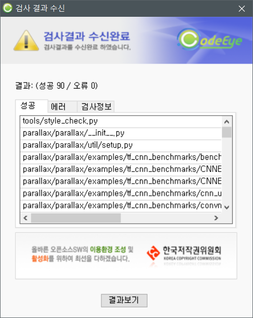
1. 위 창은 검사 결과가 성공적으로 나온 것이다.
1. **결과보기** 를 클릭한다.

# 6. 검사 결과 확인 및 GitHub에 업로드

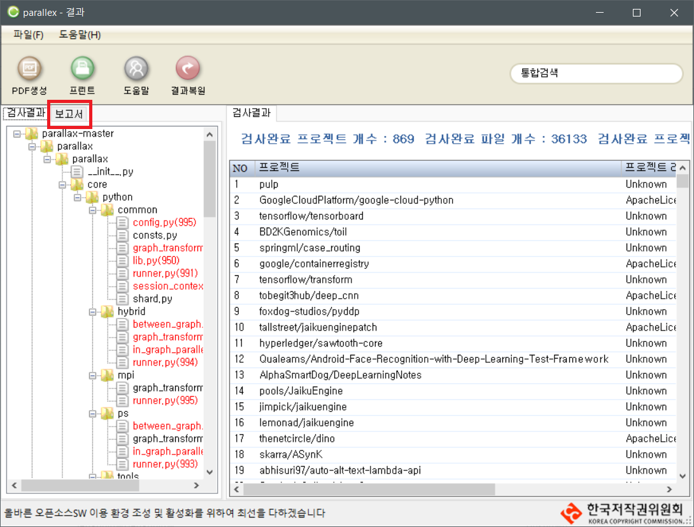
1. 위와 같은 창이 나타난다.
1. **보고서** 탭을 클릭한다.

 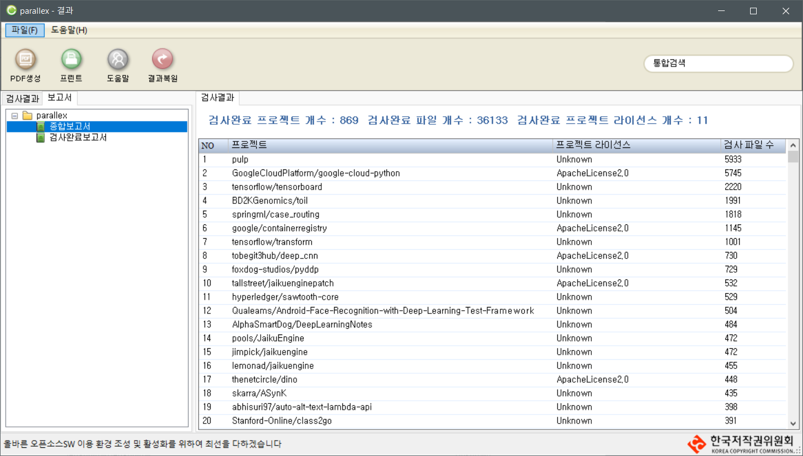
1. 화면 왼쪽에 있는 **종합보고서** 를 클릭하고, 그 위 있는 PDF 생성을 클릭하여 종합보고서를 다운로드한다.
1. **검사완료보고서** 도 같은 방법으로 다운로드한다.
1. 그러면 ``'종합보고서.pdf'``와 ``'검사완료보고서.pdf'``가 다운로드되었을 것이다.
1. 이것을 repository의 최상위 디렉토리에 ``license_report``를 만들어 두 PDF 보고서 파일을 업로드한다.

# 7. VIC GitHub에 제출 혹은 업데이트
VIC GitHub에 repository를 제출하는 방법은 이 문서 [osw-submission-tutorial.md](osw-submission-tutorial.md)를 참고한다.

끝
