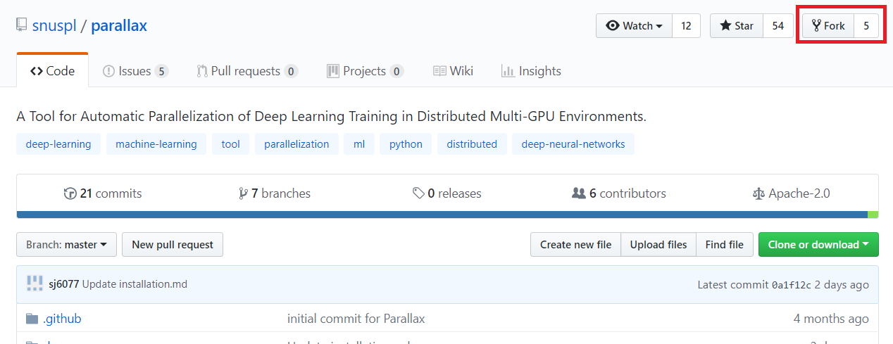

# VTT 오픈소스 성과물 제출 방법

* [VIC GitHub](https://github.com/videoturingtest)에 member로 참여한다. 조성재 연구원(sjcho@bi.snu.ac.kr)에게 GitHub name과 함께 참여 신청을 한다.

## 1. 처음 VIC GitHub에 Fork하는 경우


* 저작자의 repository GitHub에 들어가서 화면 오른쪽 상단에 [VIC GitHub](https://github.com/videoturingtest)에 fork한다.  

## 2. 이미 VIC GitHub에 Fork된 Repository를 업데이트하는 경우
parallex를 예시로 방법을 소개한다.
* 저작자 repository 주소: [https://github.com/snuspl/parallex](https://github.com/snuspl/parallax)
* VIC repository 주소: [https://github.com/videoturingtest/parallex](https://github.com/videoturingtest/parallax)

이때 아래와 같이 실행시키면 VIC GitHub에 fork된 repository를 저작자의 repository 상태로 업데이트할 수 있다.

```Bash
git clone https://github.com/videoturingtest/parallax.git
cd parallax/
git remote add upstream https://github.com/snuspl/parallax.git
git fetch upstream
git merge upstream/master
git push origin master
```
